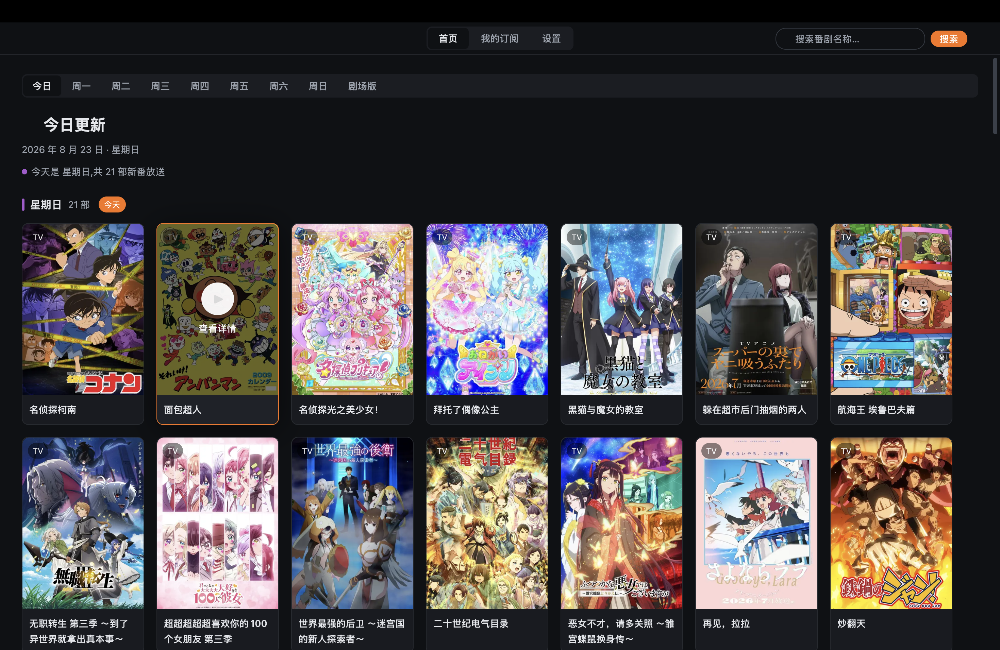

# MikanPlus

一个桌面追番应用，基于 [gpui](https://gpui.rs) 构建，数据源为[蜜柑计划](https://mikanani.me)。

## 功能

- 今日更新、按星期浏览、剧场版、在线搜索
- 以字幕组为单位订阅。
- 内嵌 BT 下载(磁力链接)。
- 下载完成一键用系统播放器打开
- 深色/浅色主题

## ScreenShot

## 免责声明

本项目基于个人兴趣开发，仅用于学习和交流，请于下载后24小时内删除。使用时应遵守当地法律法规，请勿用于违法用途。

## License

Apache-2.0
