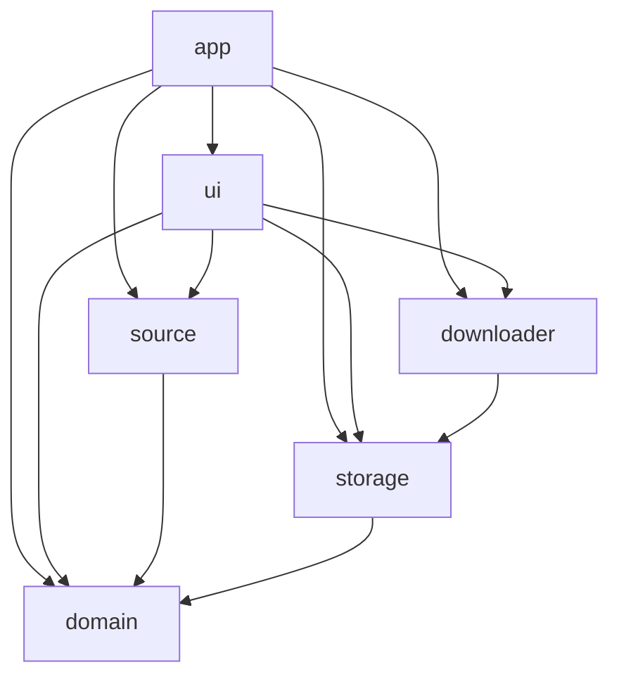

# Architecture

MikanPlus follows the GPUI Kit application architecture: dependencies point downward, the application shell owns orchestration, and reusable capabilities do not depend on presentation.



## Crate responsibilities

### `domain`

Owns serialized domain records and navigation values. It has no GPUI, network, filesystem, or download-engine dependency.

### `storage`

Owns local state, cache layout, migrations, application directories, filename normalization, and platform operations for opening files and URLs.

### `source`

Owns the Mikan HTTP adapter, request throttling and backoff, URL normalization, and HTML parsing into `domain` records.

### `downloader`

Owns the librqbit session, command serialization, torrent metadata, task snapshots, cancellation, and cleanup. Commands are processed in send order while snapshot generation remains independent.

### `ui`

Owns application presentation, theme configuration, page-local retained state, and UI Actions. It accesses GPUI only through `gpui-kit` and places stateful component entities in the view that owns their lifecycle.

### `app`

Is the composition root. It initializes GPUI Kit, creates the window `Root`, binds Actions, installs native menus, owns application-wide state, and coordinates storage, source, downloader, and UI capabilities.

## Dependency rules

- GPUI ecosystem APIs are imported only through `gpui-kit`.
- `domain` must remain independent of GPUI and infrastructure.
- Lower-level crates must not depend on `app`.
- Cross-crate APIs expose domain intent rather than implementation details where practical.
- Background work must not retain a closed GPUI entity indefinitely.
- Repeated UI elements use stable domain-derived identities.
- Theme definitions may contain concrete colors; application rendering should use semantic theme values.

## Validation

The workspace quality gate is:

```bash
cargo fmt --all --check
cargo clippy --workspace --all-targets --all-features -- --deny warnings
cargo test --workspace --all-features
```
